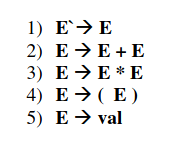
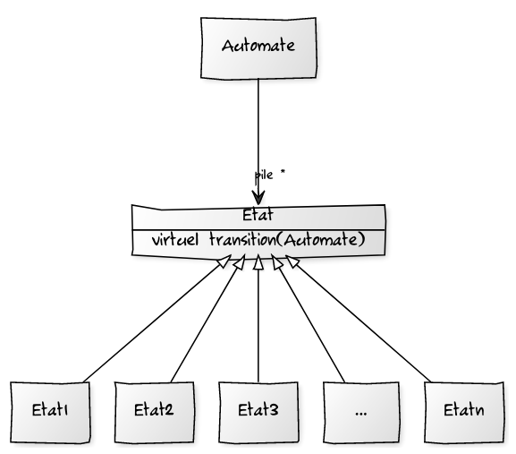
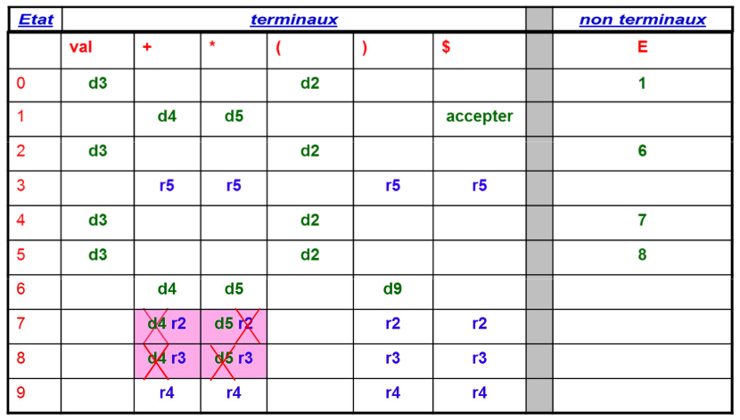
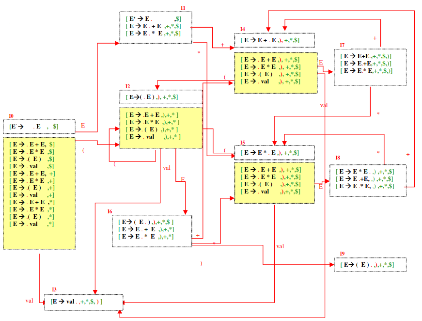

# CalculatorCompiler
Syntax analysis and evaluation of an arithmetic expression thanks to a LALR(1) bottom-up analyzer. 

## Requirements
* C++ version 11 or greater for the analyzer.
* CMake version 13 or greater for the tests.

## How to run the analyzer ?
The various possible actions can be performed using a Makefile. 

Here is the list of the different possible actions : 

* `make run`

This command allows to run the analyzer.

It is also possible to add some options to this command :
* `make run debug=true`

The option *debug* activates the console Display of calls to constructors and destructors
of objects.

* `make run states=true`

The option *states* activates the console Display of the state path followed by the automaton.

* `make memory_check`

This command allow to run the program with Valgrind to check if there is memory issue.

* `make clean`

This command allows to delete the binary files generated by the build of the program.

* `make cleanall`

This command allows to delete the binary files and the executable generated by the build of the program. 

* `make gtest`

This command allows to run the Google tests of the project.
The tests consist in evaluating 1000 randomly generated expressions.  

* `make cleantest`

This command allow to delete the files generated by the CMake build of the tests.

## How it works ? 

### Grammar
The LALR(1) bottom-up analyzer is based on the following grammar : 

### State Design Pattern
We use the State Design Pattern which allows for an easy representation of a state machine. Depending on the context of the automaton (the state), the action to run can be customized.

### Parse Table
Below is the LALR(1) analysis table :

### LALR(1) Automaton States Graphe
Below is the states graphe of the LALR(1) automaton which shows the different possible transitions between the states : 

